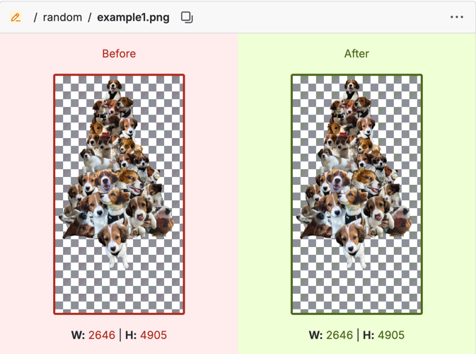
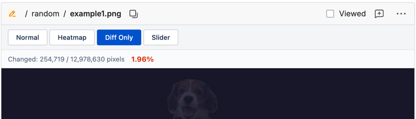

# Bitbucket Image Diff Heatmap

A Chrome extension that adds heatmap visualization, diff-only view, and slider comparison to image diffs in Bitbucket pull requests.

## The Problem

Bitbucket shows image changes as a simple before/after side-by-side, making it hard to spot subtle differences:

## The Solution

This extension injects a toolbar with four viewing modes directly into the PR diff:

### Heatmap

Color-coded overlay highlighting exactly where pixels changed. Adjustable opacity with a blue-to-red gradient (low to high difference).

### Diff Only

Isolates changed pixels on a dark background — unchanged areas are dimmed so modifications stand out immediately.

### Slider

Drag to compare before and after side by side in a single view.

## Features

- **Four viewing modes** — Normal, Heatmap, Diff Only, Slider
- **Pixel-level stats** — shows exact count and percentage of changed pixels
- **Lazy loading** — diff is computed only when you switch away from Normal mode
- **SPA-aware** — works with Bitbucket's single-page navigation via MutationObserver

## Installation

### From source (developer mode)

1. Clone this repository
2. Open `chrome://extensions` in Chrome
3. Enable **Developer mode** (top-right toggle)
4. Click **Load unpacked** and select the project folder

### From Chrome Web Store

Install directly from the [Chrome Web Store](https://chromewebstore.google.com/detail/bitbucket-image-diff-heat/glkhomlibchboimhmgmacjghcfhapjfg).

## How It Works

The extension runs as a content script on `bitbucket.org`. It detects image diff pairs (`[data-testid="image-diff"]`), fetches both images, computes per-pixel differences on a canvas, and renders the heatmap/diff/slider views inline.
